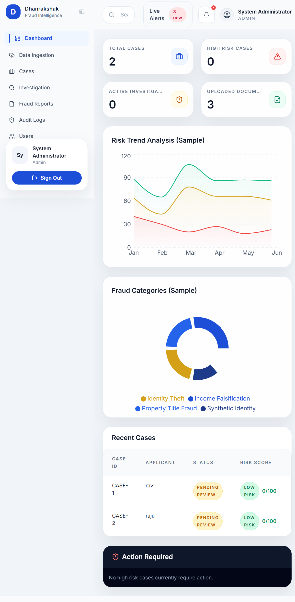
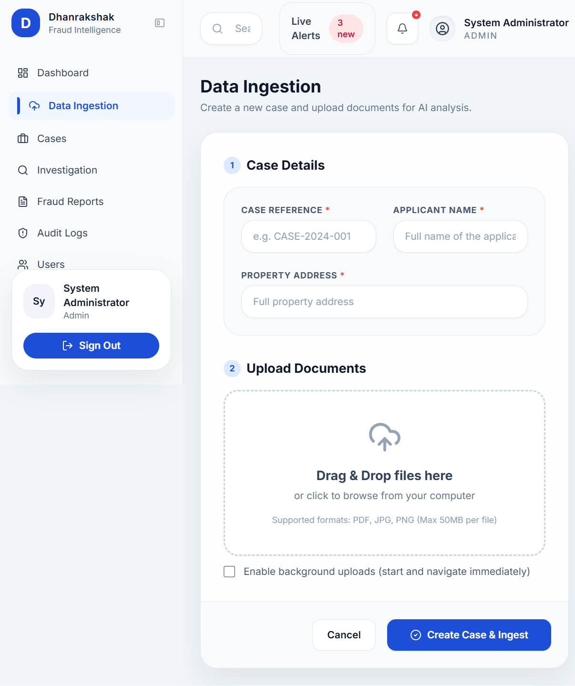
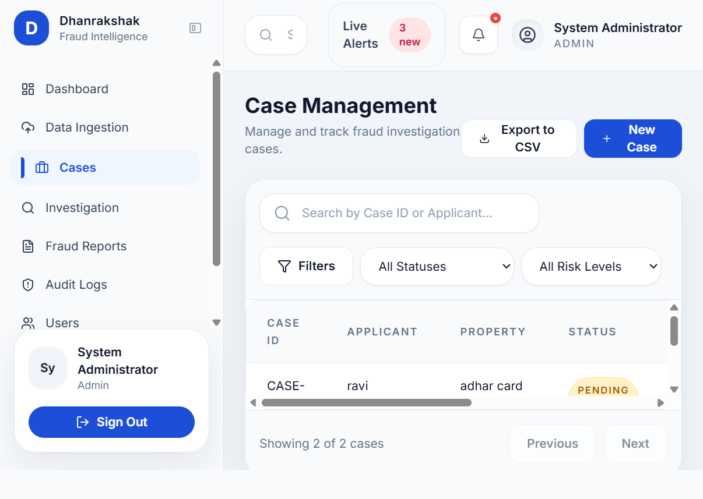
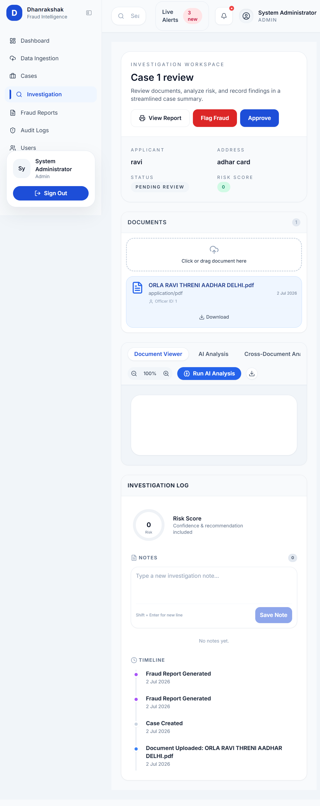
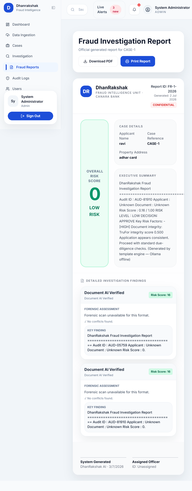
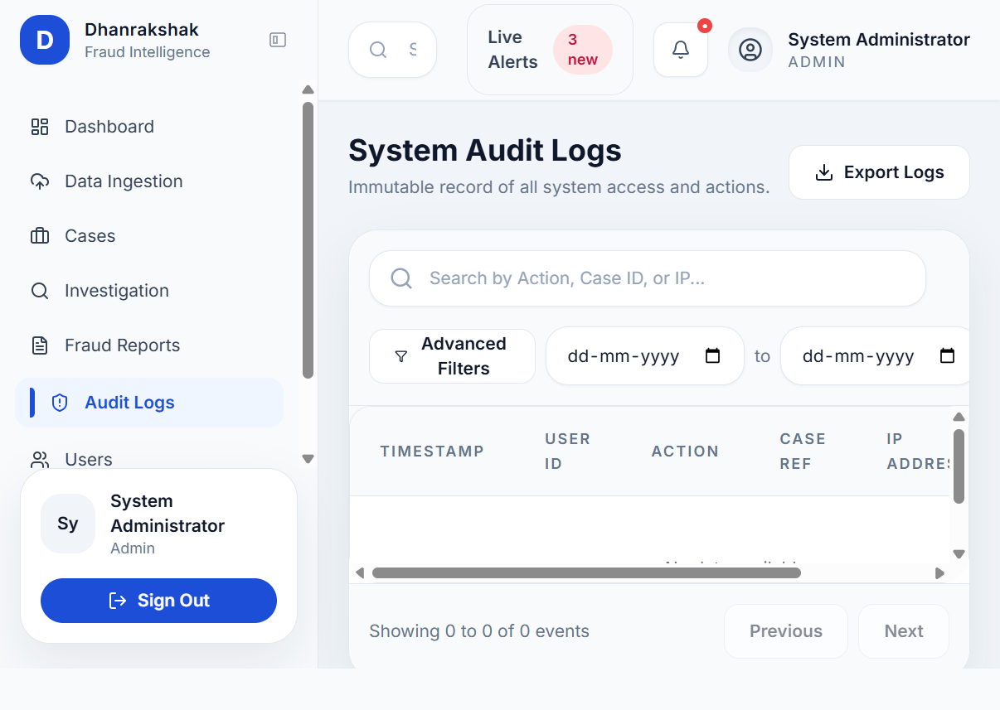
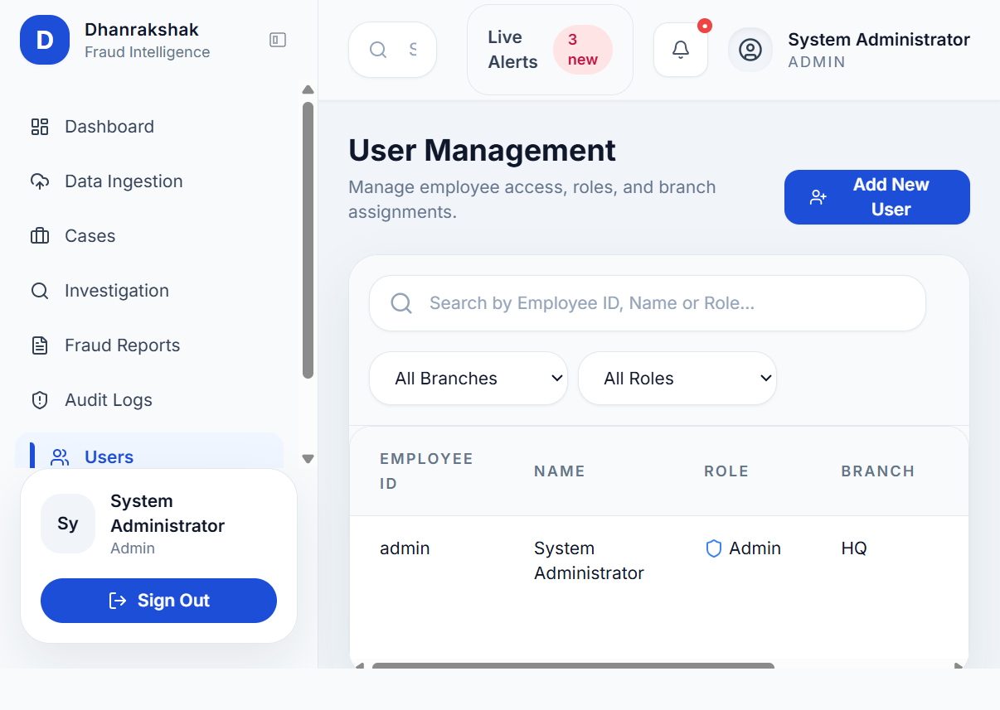
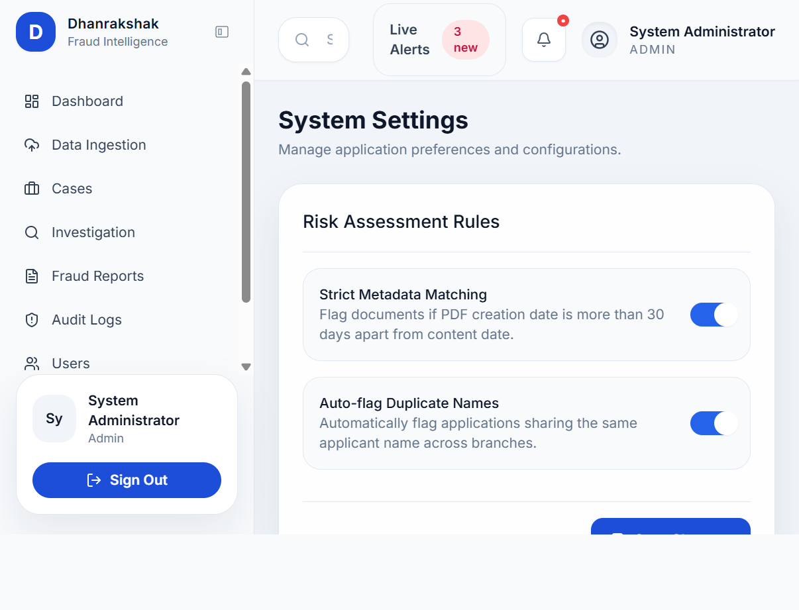

# Page Buttons and Features

This document maps the main frontend pages to the primary features and buttons currently exposed in the UI.

## Route Map

- Dashboard: [frontend/src/pages/Dashboard.jsx](frontend/src/pages/Dashboard.jsx)
- Data Ingestion: [frontend/src/pages/Ingest.jsx](frontend/src/pages/Ingest.jsx)
- Case Management: [frontend/src/pages/CaseManagement.jsx](frontend/src/pages/CaseManagement.jsx)
- Investigation: [frontend/src/pages/Investigation.jsx](frontend/src/pages/Investigation.jsx)
- Fraud Report: [frontend/src/pages/FraudReport.jsx](frontend/src/pages/FraudReport.jsx)
- Audit Logs: [frontend/src/pages/AuditLogs.jsx](frontend/src/pages/AuditLogs.jsx)
- User Management: [frontend/src/pages/UserManagement.jsx](frontend/src/pages/UserManagement.jsx)
- Settings: [frontend/src/pages/Settings.jsx](frontend/src/pages/Settings.jsx)

## Dashboard

Page: [frontend/src/pages/Dashboard.jsx](frontend/src/pages/Dashboard.jsx)

Screenshot:

Main features:
- KPI cards for total cases, high risk cases, active investigations, and uploaded documents.
- Risk trend chart and fraud category chart.
- Recent cases table.
- Action required panel for high-risk cases.

Buttons and actions:
- Quick Review: opens the investigation page for a case.
- Review: opens the selected high-risk case for review.

## Data Ingestion

Page: [frontend/src/pages/Ingest.jsx](frontend/src/pages/Ingest.jsx)

Screenshot:

Main features:
- Create a new case.
- Upload one or more documents.
- Optional background upload mode.
- File upload progress and retry/cancel handling.

Buttons and actions:
- Cancel: exits the ingest flow.
- Create Case & Ingest: creates the case and uploads files.
- Enable background uploads checkbox: switches to background upload mode.
- FileUploader controls: add files, remove files, cancel upload, retry upload.

## Case Management

Page: [frontend/src/pages/CaseManagement.jsx](frontend/src/pages/CaseManagement.jsx)

Screenshot:

Main features:
- Search, filter, and review cases.
- Case list with status and risk score.
- New case creation modal.

Buttons and actions:
- Export to CSV: exports the case list.
- New Case: opens the new case modal.
- Filters: opens the filter controls area.
- Investigate: opens the selected case in Investigation.
- Previous / Next: pagination controls.
- Modal buttons: Cancel and Create Case.

## Investigation

Page: [frontend/src/pages/Investigation.jsx](frontend/src/pages/Investigation.jsx)

Screenshot:

Main features:
- Document browser and preview.
- AI analysis for a selected document.
- Cross-document analysis.
- Investigation notes and timeline.
- Risk gauge and case summary.

Buttons and actions:
- View Report: opens the fraud report for the case.
- Flag Fraud: marks the case as fraud confirmed.
- Approve: approves the case.
- Document Viewer / AI Analysis / Cross-Document Analysis tabs: switch the workspace view.
- Zoom out / Zoom in: adjust document viewing scale.
- Run AI Analysis: starts ML analysis on the selected document.
- Download: downloads the active document.
- Run Pair Analysis: compares two selected documents.
- Save Note: adds a new investigation note.
- Document list items: select a document to preview.
- Upload area: click or drag to upload a document.

## Fraud Report

Page: [frontend/src/pages/FraudReport.jsx](frontend/src/pages/FraudReport.jsx)

Screenshot:

Main features:
- Official report view for a case.
- Risk score summary and executive summary.
- Detailed findings section.
- Print-friendly layout.

Buttons and actions:
- Go to Cases: returns to the case list.
- Retry: reloads the report data.
- Download PDF: downloads the report as a PDF.
- Print Report: opens the browser print dialog.

## Audit Logs

Page: [frontend/src/pages/AuditLogs.jsx](frontend/src/pages/AuditLogs.jsx)

Screenshot:

Main features:
- Audit trail table.
- Log filtering and paging.

Buttons and actions:
- Export Logs: downloads audit records.
- Advanced Filters: opens advanced filter controls.
- Previous / Next: pagination controls.

## User Management

Page: [frontend/src/pages/UserManagement.jsx](frontend/src/pages/UserManagement.jsx)

Screenshot:

Main features:
- User list and account administration.

Buttons and actions:
- Add New User: opens the user creation flow.
- Row action icon button: performs per-user row actions from the table.

## Settings

Page: [frontend/src/pages/Settings.jsx](frontend/src/pages/Settings.jsx)

Screenshot:

Main features:
- Application settings and preferences.

Buttons and actions:
- Save Changes: saves settings changes.

## Notes

- Some controls are icon-only buttons, especially in the investigation workspace and user rows.
- Shared navigation buttons in the sidebar and top bar are global and appear on most pages rather than being page-specific.
- The list above focuses on the current visible UI actions in the main frontend pages.
